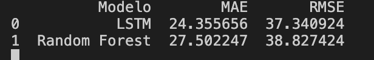

# Análisis y recopilación de algoritmia de IA en el ámbito del Mantenimiento Predictivo  

Este repositorio acompaña al **Trabajo de Fin de Grado (TFG)** titulado:  
**“Análisis y recopilación de algoritmia de IA en el ámbito del Mantenimiento Predictivo”**.  

El proyecto combina un **estudio teórico-comparativo** de los algoritmos más relevantes en PdM con una **aportación práctica**, implementando y comparando modelos de Machine Learning y Deep Learning sobre un dataset de referencia de la NASA.  

---

## 📖 Descripción  

El objetivo de este TFG es **introducir, analizar, clasificar y comparar diferentes algoritmos de Inteligencia Artificial (IA)** aplicados al Mantenimiento Predictivo, abordando desde una introducción a la IA y al sector de Mantenimiento, así como sus ventajas, limitaciones y dentro de mi tema los datasets más utilizados y casos de aplicación industrial.  

Además, se incluye una **aportación práctica** en la que se compara el rendimiento de:  
- Un modelo clásico: **Random Forest (RF)**.  
- Un modelo basado en Deep Learning: **LSTM (Long Short-Term Memory)**.  

Ambos se aplican sobre el dataset **NASA CMAPSS** para la predicción de la **Remaining Useful Life (RUL)** de motores aeronáuticos.  

---

## 🧑🏽‍💻 Aportación Práctica  

La parte experimental se centra en predecir la vida útil restante (**RUL**) de los motores, comparando la capacidad de generalización de los modelos:  

- **Random Forest (RF):** rápido, interpretable, adecuado para datos tabulares.  
- **LSTM:** especializado en series temporales, captura patrones complejos en la degradación.  

### 📊 Resultados obtenidos  

| Modelo         | MAE    | RMSE   |
|----------------|--------|--------|
| **LSTM**       | 24.36  | 37.34  |
| **Random Forest** | 27.50  | 38.82  |

### 🔎 Gráfica comparativa  

  

El análisis de los resultados, así como los hallazgos, los desafios a futuro y las conlusiones de las mismas, se encuentran en el TFG.

---

## 📂 Estructura del Repositorio  
1. 📄 Anteproyecto.pdf
2. 📄 TFG.pdf
3. 📂 Aportacion_practica/
   * LSTM.py
   * RF.py 
   * Comparativa.py
   * Requisitos_previos.txt
   * 📂 CMAPSSData/ 
4. 📂 Resultados/
    * Tabla.png
    * Gráfica.png 

---

## 💿 Dataset Utilizado  

El dataset empleado es **CMAPSS**, proporcionado por el **NASA Prognostics Center of Excellence (PCoE)**:  

🔗 [Descargar CMAPSS Dataset](https://data.nasa.gov/dataset/cmapss-jet-engine-simulated-data)  

Contiene series temporales de sensores de motores aeronáuticos bajo diferentes condiciones de operación, hasta el fallo.

---

## 👤 Autor  

Este repositorio forma parte de mi **Trabajo de Fin de Grado en Ingeniería en Sistemas de Información**.  

- **Título:** *Análisis y recopilación de algoritmia de IA en el ámbito del Mantenimiento Predictivo*  
- **Autor:** *Aldair Yasser Meza Carrasco*
- **Universidad:** *Politécnica de Alcalá de Henáres*
- **Año:** *2025* 

